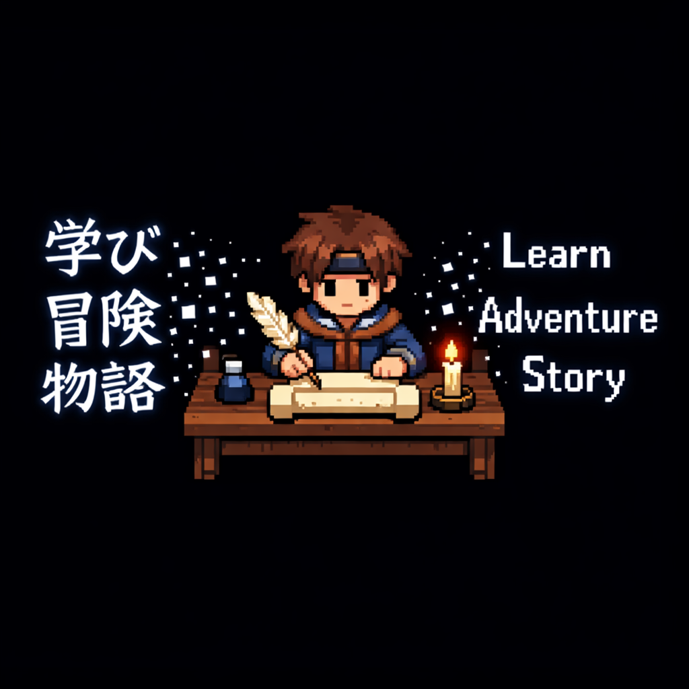

<p align="center">
  
</p>

<h1 align="center">RPG Maker Translator</h1>

<p align="center">
Translate RPG Maker MV/MZ games from Japanese to English.<br>
<b>Local LLM</b> (Ollama + Sugoi — free, private, no limits) or <b>Cloud API</b> (OpenAI, Gemini, DeepSeek, Anthropic — fast, pay-per-token).<br>
Pronoun-aware. Glossary-driven. Batch translation with resume. Open translations in RPG Maker.<br>
Designed by a human, coded with <a href="https://claude.ai/code">Claude Code</a>.
Cloud API engine ported from <a href="https://github.com/dazedanon/DazedMTLTool">DazedMTLTool</a> (MIT).
</p>

<p align="center">
  <a href="https://ko-fi.com/moritranslates"></a>
</p>


## At a Glance

Open a game folder. Hit Batch Translate. Get a playable English translation. Open it in RPG Maker to QA — no copying files, no manual setup.

| | |
|---|---|
| **Local LLM (free)** | Ollama + [Sugoi Ultra 14B](https://huggingface.co/sugoitoolkit/Sugoi-14B-Ultra-GGUF) on your GPU — no API keys, no limits |
| **Cloud API (pay-per-token)** | OpenAI, Gemini, DeepSeek, Anthropic — DazedMTL-compatible batch mode with live cost tracking |
| **Pronoun system** | Actor genders, speaker detection, `\N[n]` character mapping — the LLM knows who's "he" and who's "she" |
| **Glossary-driven** | Two-layer glossary auto-built from translated DB names — "Potion" stays "Potion" everywhere |
| **Open in RPG Maker** | One-click workspace with directory junctions — edit and playtest translations in RPG Maker's visual editor |
| **Crash-proof** | Auto-saves every 25 entries, project resume, translation memory deduplication |

---

## Table of Contents

- [Key Features](#key-features)
- [Quick Start](#quick-start)
- [Recommended Models](#recommended-models)
- [Cloud API Providers](#cloud-api-providers)
- [Translation Workflow](#translation-workflow)
- [Glossary System](#glossary-system)
- [Open in RPG Maker](#open-in-rpg-maker)
- [Settings Reference](#settings-reference)
- [Supported Formats & Languages](#supported-formats--languages)
- [Troubleshooting](#troubleshooting)
- [Acknowledgments](#acknowledgments)

---

## Key Features

- **Pronoun-aware gender system** — Assigns actor genders, detects speakers from dialogue headers, maps `\N[n]` codes to characters so the LLM uses correct pronouns.
- **Two-stage workflow** — Translate database names first (items, skills, enemies), then dialogue. DB names auto-populate the glossary.
- **Two-layer glossary** — General glossary (shared, ~100 presets) + project glossary (auto-built from DB translations). Smart injection — only matching terms sent per request.
- **Batch by Actor** — Groups dialogue by speaker gender (female > male > unknown) for maximum pronoun accuracy.
- **Translation memory** — Deduplicates identical strings before batch. If 50 NPCs say the same line, the LLM translates it once.
- **Translation history** — Last 10 translations sent as context so the LLM maintains consistent tone and pronouns across sequential dialogue.
- **Auto-retry** — Detects leftover Japanese in output and retries with a stronger prompt.
- **Auto-save & checkpointing** — Saves every 25 entries during batch. Crash-proof.
- **DazedMTL Mode** — One-click toggle: batch 30, 4 workers, DazedMTL prompt. Works with both local Sugoi and cloud APIs.
- **Open in RPG Maker** — Creates a workspace with directory junctions so you can QA and playtest translations in RPG Maker's visual editor. Auto-detects MV vs MZ.
- **Cloud cost tracking** — Real-time token count and USD cost during batch translation.
- **Translation variants** — Generate 3 different translations per entry and pick the best one.
- **Grammar polish** — English-to-English LLM pass to fix awkward phrasing without retranslating from Japanese.
- **Prompt presets** — Default, Sugoi (DazedMTL Full), DazedMTL Simple, or Custom. Reset Default and Clear buttons.

---

## Quick Start

### 1. Install Ollama + Sugoi

```bash
# Install Ollama: https://ollama.com/download
# Then grab Sugoi (best JP→EN model):
ollama run hf.co/sugoitoolkit/Sugoi-14B-Ultra-GGUF
```

### 2. Install & Run

```bash
pip install -r requirements.txt
python main.py
```

### 3. Translate

1. **Project > Open Project** — point to your game folder
2. **Assign actor genders** in the popup dialog
3. **Batch DB** (`Ctrl+D`) — translate names/items/skills first
4. **Batch Dialogue** (`Ctrl+T`) — translate dialogue with auto-glossary
5. **Game > Apply Translation** (`Ctrl+E`) — write back to game files
6. **Game > Open in RPG Maker** (`Ctrl+R`) — QA in the visual editor

---

## Recommended Models

### Sugoi Ultra 14B — JP→EN (Recommended)

Fine-tuned on visual novel, RPG, and manga JP→EN data. Handles honorifics, adult content, and RPG Maker control codes natively.

| GPU VRAM | Quantization | Command |
|---|---|---|
| **8GB** | Q2_K | `ollama run hf.co/sugoitoolkit/Sugoi-14B-Ultra-GGUF:Q2_K` |
| **10-12GB** | Q4_K_M (default) | `ollama run hf.co/sugoitoolkit/Sugoi-14B-Ultra-GGUF` |
| **16GB** | Q8_0 | `ollama run hf.co/sugoitoolkit/Sugoi-14B-Ultra-GGUF:Q8_0` |

### No GPU? Use Cloud APIs

In Settings, switch Provider to OpenAI/Gemini/DeepSeek/Anthropic, enter your API key, and go. Same workflow, same features, pay per token. Cheapest option: **Gemini 2.0 Flash** at $0.10/$0.40 per 1M tokens.

### Qwen3 — Multi-Language

For non-English targets (Chinese, Korean, Spanish, French, etc.), use **Qwen3** (`ollama pull qwen3:14b`). 24 languages supported with quality ratings in Settings.

| GPU VRAM | Model | Command |
|---|---|---|
| **8GB** | Qwen3:8b | `ollama pull qwen3:8b` |
| **10-12GB** | Qwen3:14b | `ollama pull qwen3:14b` |
| **16GB** | Qwen3:14b-q8_0 | `ollama pull qwen3:14b-q8_0` |
| **24GB** | Qwen3:30b-a3b | `ollama pull qwen3:30b-a3b` |

---

## Cloud API Providers

| Provider | Models | Pricing (per 1M tokens) |
|---|---|---|
| **Google Gemini** | gemini-2.0-flash, 2.5-flash, 2.5-pro | $0.10–$1.25 in / $0.40–$10.00 out |
| **OpenAI** | gpt-4.1-mini, gpt-4.1, gpt-5 | $0.40–$2.00 in / $1.60–$10.00 out |
| **DeepSeek** | deepseek-chat | $0.27 in / $1.10 out |
| **Anthropic** | claude-sonnet-4.5 | $3.00 in / $15.00 out |

All providers use the OpenAI SDK as a universal abstraction. Switch in Settings > Provider, enter your API key, and the rest is automatic — batch size, workers, and prompt presets auto-configure.

---

## Translation Workflow

### Two-Stage Batch (Recommended)

1. **Batch DB** (`Ctrl+D`) — Translates database entries: item names, skill names, enemy names, system terms. These become glossary entries.
2. **Review DB names** — Fix any mistranslations in the table. Corrections auto-update the glossary.
3. **Batch Dialogue** (`Ctrl+T`) — Translates dialogue, events, and plugin text using the glossary built in step 1.

This prevents inconsistencies like an NPC saying "Take the Holy Sword" when the inventory calls it "Sacred Blade".

### Other Batch Modes

- **Batch All** (`Ctrl+Shift+T`) — DB + dialogue in one pass (skips manual review step)
- **Batch by Actor** (`Ctrl+Shift+A`) — Groups by speaker gender for best pronoun accuracy. Shows a breakdown before starting.

### Per-Entry Tools (Right-Click Menu)

- **Translate Selected** — Translate specific rows
- **Retranslate with Correction** — Hint what was wrong ("use she/her", "too literal")
- **Show Variants (3 options)** — Pick from 3 different translations
- **Mark Reviewed / Skip** — Track QA progress
- **Polish Grammar** — English-to-English cleanup pass

---

## Glossary System

The glossary forces the LLM to use specific translations for Japanese terms. Only terms that appear in the current text are injected — a 200-entry glossary doesn't bloat prompts.

**Two layers:**
- **General Glossary** (Settings) — Shared across all projects. ~100 presets for common RPG terms.
- **Project Glossary** (Settings) — Per-project. Auto-populated from translated DB names.

Project entries override general entries for the same JP term.

**Glossary menu:**
- Import/Export vocab files (DazedMTL-compatible format)
- Scan a translated game folder for JP→EN pairs
- Build glossary from this project's translations
- Apply glossary to fix inconsistent translations

---

## Open in RPG Maker

**Game > Open in RPG Maker** (`Ctrl+R`) creates a workspace folder with directory junctions pointing to the game's data and assets. RPG Maker opens it as a project — you can playtest, inspect events, and verify translations in the visual editor.

- Auto-detects MV vs MZ engine
- Zero disk space (junctions, not copies)
- Edits in RPG Maker write directly to game files
- Works with RPG Maker MV ($6 on sale) or MZ

---

## Settings Reference

| Setting | Default | Description |
|---------|---------|-------------|
| Provider | Ollama (Local) | Translation engine — Ollama, OpenAI, Gemini, DeepSeek, Anthropic, Custom |
| Model | (auto-detected) | LLM model. Sugoi recommended for JP→EN |
| Prompt Preset | Default / Sugoi | Preset prompt or Custom. Reset Default / Clear buttons |
| DazedMTL Mode | Off | One-click: batch 30, 4 workers, DazedMTL prompt |
| Target Language | English | 24 languages with quality ratings |
| Context window | 3 | Recent dialogue lines as context (higher = better coherence) |
| Workers | 2 | Parallel translation threads (auto-set by provider) |
| Batch size | 1 | Lines per request (auto-set: 1 local, 30 cloud) |
| Translation history | 10 | Recent translations sent as assistant messages |
| Dark mode | On | Catppuccin dark theme |

---

## Supported Formats & Languages

### Game Formats

| Format | Status |
|---|---|
| RPG Maker MV (.json) | Supported |
| RPG Maker MZ (.json) | Supported |
| RPG Maker VX Ace (.rvdata2) | Planned |

### Target Languages

24 languages supported. English is the primary target (use Sugoi for best quality). Other languages use Qwen3 with quality rated 2-5 stars in Settings.

**Top tier:** English, Chinese (Simplified/Traditional), Korean, Spanish, Portuguese, French, German
**Good:** Russian, Italian, Polish, Dutch, Turkish, Indonesian, Vietnamese, Thai, Malay
**Fair:** Arabic, Hindi, Ukrainian, Czech, Romanian, Hungarian, Tagalog

---

## Troubleshooting

| Problem | Fix |
|---|---|
| "Cannot connect to Ollama" | Run `ollama serve` in a terminal first |
| Translations are slow | Each entry takes 2-10s. Use a smaller model or switch to cloud API |
| Wrong pronouns | Assign correct genders in the actor dialog, or use Batch by Actor mode |
| Missing control codes | Right-click > Restore Missing Codes, or they auto-restore at checkpoints |
| Cloud API errors | Check your API key in Settings. Test Connection button verifies connectivity |
| Plugin translations break game | Plugin entries are skipped by default. Only unskip display text (menu labels, descriptions) |

---

## Acknowledgments

- **[DazedMTLTool](https://github.com/dazedanon/DazedMTLTool)** (MIT) — Cloud API engine, batch translation approach, prompt presets, and pricing config ported from DazedMTL. DazedMTL Mode mirrors their exact translation pipeline.
- **[Sugoi Toolkit](https://huggingface.co/sugoitoolkit)** — Fine-tuned JP→EN translation models optimized for visual novels and RPGs.
- **[Ollama](https://ollama.com/)** — Local LLM inference server that makes GPU translation free and private.

---

## License

MIT
