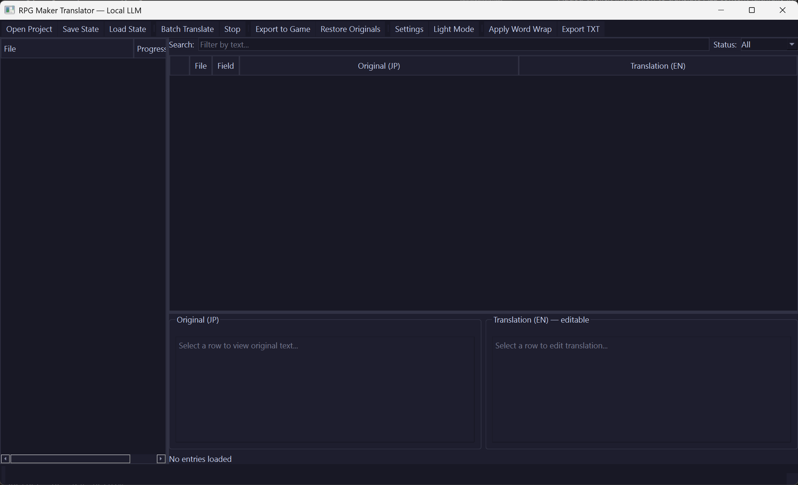

# RPG Maker Translator — Local LLM

A desktop tool for translating RPG Maker MV/MZ games using a local LLM — no cloud API, no API keys, no per-token costs. Runs entirely on your machine with Ollama. Architected and built in 3 days — designed by a human, coded with [Claude Code](https://claude.ai/code).

**24 target languages** | **Pronoun-aware gender system** | **Two-layer glossary** | **Batch translation with ETA** | **Auto-save & resume** | **Dark mode**



## Key Features

- **24 target languages** — English, Chinese, Korean, Spanish, French, German, Russian, and 17 more with quality ratings and model size guidance
- **100% local & free** — No cloud API, no API keys, no usage limits. Your data never leaves your machine
- **Pronoun-aware translation** — Actor gender assignment, speaker detection, and per-character pronoun hints so the LLM gets he/she/they right
- **Two-layer glossary** — General glossary (shared across projects) + project glossary (auto-populated from translated DB names) for consistent terminology
- **Two-stage workflow** — Translate database names first (Batch DB), then dialogue (Batch Dialogue) with auto-glossary so item/skill/character names stay consistent
- **Batch by Actor** — Groups dialogue by speaker gender for the most accurate pronoun handling
- **Translation memory** — Auto-fills duplicate strings before batch translation, saving LLM calls
- **Translation history** — Sends recent translations as context so the LLM maintains consistent tone and pronouns
- **Auto-retry** — Detects leftover Japanese in translations and automatically retries with a stronger prompt
- **Grammar polish** — English-to-English LLM pass to fix grammar without retranslating from Japanese
- **Translation variants** — Generate 3 different translations and pick the best one
- **Plugin parameter extraction** — Translates menu labels, UI strings, and descriptions from `plugins.js`
- **Auto-save & checkpointing** — Auto-saves every 2 minutes + checkpoint every 25 entries during batch translation
- **QA tools** — "JP in translation" filter to find incomplete translations, cross-file search, missing control code detection
- **Export & restore** — Write translations back to game files with backup-based idempotent re-export
- **Dark mode** — Catppuccin dark theme

## Requirements

- **Windows 10/11** (tested on Windows)
- **Python 3.10+**
- **NVIDIA GPU** recommended (AMD GPUs partially supported — see below)
- **Ollama** installed and running

## Recommended Models

### Sugoi Ultra 14B — Best for JP→EN (Recommended)

**Sugoi Ultra 14B** is a JP→EN specialized translation model fine-tuned from Qwen2.5-14B on visual novel, RPG, and manga parallel data. It produces significantly better JP→EN translations than general-purpose models — nearly 2x the BLEU score of previous versions.

| GPU (VRAM) | Quantization | VRAM Usage | Quality |
|---|---|---|---|
| **8GB** (RTX 3060/4060) | Q2_K | ~5.8GB | Good |
| **10-12GB** (RTX 3080/4070/4070 Ti) | Q4_K_M | ~9.0GB | Great |
| **16GB** (RTX 4080/5070 Ti/5080) | Q8_0 | ~15.7GB | Excellent |
| **24GB+** (RTX 4090/5090) | F16 | ~29.5GB | Best |

**Install via HuggingFace:**
```bash
ollama run hf.co/sugoitoolkit/Sugoi-14B-Ultra-GGUF
```

This downloads the Q4_K_M quantization by default (~9GB). For other quantizations, specify the variant:
```bash
ollama run hf.co/sugoitoolkit/Sugoi-14B-Ultra-GGUF:Q8_0
```

**Why Sugoi?** Fine-tuned specifically on JP→EN parallel translation data including VNs, RPGs, and manga. Handles RPGM bracket-heavy text, honorifics, and adult content natively. The tool auto-detects Sugoi and uses an optimized prompt.

### Qwen3 — Multi-Language (24 Target Languages)

If you need to translate into languages other than English, use Qwen3. It supports 119 languages with strong JP comprehension.

| GPU (VRAM) | Recommended Model | Command | Quality | Speed |
|---|---|---|---|---|
| **8GB** (RTX 3060/4060) | Qwen3:8b | `ollama pull qwen3:8b` | Good | ~35 tok/s |
| **10-12GB** (RTX 3080/4070 Ti) | Qwen3:14b | `ollama pull qwen3:14b` | Great | ~25 tok/s |
| **16GB** (RTX 4080/5070 Ti) | Qwen3:14b-q8_0 | `ollama pull qwen3:14b-q8_0` | Great+ | ~35 tok/s |
| **24GB** (RTX 4090) | Qwen3:30b-a3b | `ollama pull qwen3:30b-a3b` | Excellent | ~30 tok/s |
| **32GB** (RTX 5090) | Qwen3:32b | `ollama pull qwen3:32b` | Best | ~30 tok/s |
| **CPU only** | Qwen3:4b | `ollama pull qwen3:4b` | Basic | ~5 tok/s |

**Notes:**
- Speeds are approximate and vary by text length and system config
- Models use Q4_K_M quantization by default in Ollama (good quality-to-size ratio)
- If a model barely fits your VRAM, it will work but may be slower due to partial CPU offload
- The **30b-a3b** model uses Mixture of Experts (MoE) — 30B total params but only 3.3B activated per token
- **RTX 5000 series** benefits from faster memory bandwidth (GDDR7) — expect ~20-30% speed improvement over equivalent 4000-series VRAM tiers

### AMD GPU Support

Ollama supports AMD GPUs via ROCm, but with caveats:

| GPU | VRAM | JP→EN (Sugoi) | Multi-language (Qwen3) | OS Support |
|-----|------|---------------|------------------------|------------|
| **RX 9070 XT** | 16GB | Sugoi 14B Q8_0 | Qwen3:14b-q8_0 | Linux (ROCm) |
| **RX 9070** | 12GB | Sugoi 14B Q4_K_M | Qwen3:14b | Linux (ROCm) |
| **RX 7900 XTX** | 24GB | Sugoi 14B F16 | Qwen3:30b-a3b | Linux (ROCm) |
| **RX 7900 XT** | 20GB | Sugoi 14B Q8_0 | Qwen3:30b-a3b | Linux (ROCm) |
| **RX 7800 XT** | 16GB | Sugoi 14B Q8_0 | Qwen3:14b-q8_0 | Linux (ROCm) |
| **RX 7700 XT** | 12GB | Sugoi 14B Q4_K_M | Qwen3:14b | Linux (ROCm) |
| **RX 7600** | 8GB | Sugoi 14B Q2_K | Qwen3:8b | Linux (ROCm) |
| **RX 6000 series** | Varies | Sugoi 14B Q2_K | Qwen3:8b | Linux (ROCm) |

**Important AMD notes:**
- **Linux is recommended** — ROCm has full support on Linux. Windows AMD support in Ollama uses a Vulkan fallback which is significantly slower.
- **~30-50% slower** than equivalent NVIDIA GPUs for LLM inference due to less mature software stack.
- AMD GPUs need more VRAM to match NVIDIA performance — a 12GB AMD card won't perform as well as a 12GB NVIDIA card.
- **RDNA4 (RX 9070 series)** — Brand new architecture. Ollama ROCm support may lag behind launch; check the [Ollama GitHub](https://github.com/ollama/ollama) for latest compatibility.
- If you're buying new hardware specifically for local LLM work, NVIDIA is the safer choice.

## Installation

### 1. Install Ollama

Download and install Ollama from: https://ollama.com/download

After installation, open a terminal and download the recommended model:

**For JP→EN (recommended):**
```bash
ollama run hf.co/sugoitoolkit/Sugoi-14B-Ultra-GGUF
```

**For multi-language translation:**
```bash
ollama pull qwen3:14b
```

### 2. Install Python Dependencies

```bash
pip install PyQt6 requests
```

Or using the requirements file:

```bash
pip install -r requirements.txt
```

### 3. Start Ollama

Make sure the Ollama server is running before launching the translator:

```bash
ollama serve
```

Ollama runs on `http://localhost:11434` by default. You can leave this terminal open in the background.

### 4. Launch the Translator

```bash
python main.py
```

## Getting Started

### Opening a Game Project

1. Go to **Project > Open Project** (or `Ctrl+O`)
2. Navigate to your RPG Maker MV/MZ game folder (the folder containing a `data/` or `www/data/` subfolder with JSON files)
3. The tool will scan all translatable text from database files, maps, common events, and system strings

### Actor Gender Assignment

After opening a project, a dialog will appear showing all actors found in the game. You can assign genders (male/female) so the translator uses correct pronouns (he/she). The tool auto-detects genders from profile text but you should verify.

### Translating

- **Batch DB** (`Ctrl+D`): Translates only database entries (item names, skill names, enemy names, system terms). Run this first so you can QA names before they feed into dialogue as glossary terms.
- **Batch Dialogue** (`Ctrl+T`): Translates dialogue, events, and plugin text. Warns you if no DB names have been translated yet. Translated DB names are automatically used as glossary terms.
- **Batch All** (`Ctrl+Shift+T`): Translates everything at once (DB + dialogue) — the old behavior if you don't need the two-stage workflow.
- **Batch by Actor** (`Ctrl+Shift+A`): Translates dialogue grouped by speaker gender — female speakers first, then male, then ungendered, then non-dialogue entries. Each entry gets explicit gender hints so the LLM uses correct pronouns consistently. Shows a breakdown of how many entries per gender group before starting.
- **Translate Selected**: Select rows in the table, right-click, and choose **Translate Selected** to translate specific entries.
- **Retranslate with Correction**: Right-click a translated entry and choose **Retranslate with Correction...** to provide a hint about what was wrong (e.g., "wrong pronoun", "too literal").
- **Show Variants**: Right-click and choose **Show Variants (3 options)...** to generate 3 different translations and pick the best one.
- **Polish Grammar**: Run all translations through an English-to-English LLM pass to fix grammar and improve fluency without retranslating from Japanese. Available as a batch operation (Translate menu) or per-entry (right-click).

Progress and ETA are shown in the status bar. Auto-saves every 25 entries so you don't lose progress if something crashes.

### Translation History

During batch translation, the tool sends the last N translated lines to the LLM as "assistant messages" — the model sees itself having recently translated nearby dialogue, which improves:
- **Tone consistency** — characters maintain their speech style across lines
- **Pronoun resolution** — ambiguous Japanese subjects get correct pronouns based on recent context
- **Term consistency** — repeated concepts get the same English phrasing

Configure the window size in Settings > Translation Options > Translation history (default: 10, 0 = disabled).

### Reviewing and Editing

- Click any row to view the original Japanese and English translation side-by-side in the editor panel at the bottom
- Edit the English translation directly in the right-side editor box
- Right-click the editor to insert missing control codes (`\N[1]`, `\C[2]`, etc.) from the original
- Right-click a row and choose **Mark as Reviewed** to mark it green
- **Search** across all entries regardless of file tree selection — the search box ignores control codes so you can find text without worrying about `\C[2]` etc.
- **Fix Missing Codes** (Translate menu): Batch-fix all translated entries that are missing control codes from the original

### Glossary

The glossary forces the LLM to use specific English translations for Japanese terms. Every glossary entry (JP → EN) is injected into the LLM prompt so it always translates that term consistently across every line of dialogue.

**How it works:**
- **Smart injection**: Only glossary terms that appear in the current text or context are sent to the LLM — a 200-entry glossary won't bloat prompts for lines that only mention 2 terms
- The LLM sees "Translate: 聖剣は強い / Glossary: 聖剣=Holy Sword" and uses the exact term
- Without a glossary, the same item name might be translated differently each time ("Sacred Sword" in one line, "Holy Blade" in another)

**Two glossary layers:**

1. **General Glossary** (Settings > General Glossary) — shared across all projects. When opening a new project, the tool offers to load ~100 preset translations for common terms (RPG terms, body parts, expressions). You can add, edit, or remove entries.

2. **Project Glossary** (Settings > Glossary) — per-project terms. Auto-populated from translated DB names (items, skills, enemies, actors, etc.). You can also add manual entries here.

Both layers are merged at translation time. Project entries override general entries if the same JP term exists in both.

**Auto-glossary** — When database entries are translated, their JP → EN mappings are automatically added to the project glossary. This means if "ポーション" is translated as "Potion" in Items.json, every dialogue line mentioning ポーション will also say "Potion".

**Recommended workflow** (two-stage batch):
1. **Batch DB** (`Ctrl+D`) — Translate all database names and terms first
2. Review and correct any names in the table — corrections automatically update the glossary
3. **Batch Dialogue** (`Ctrl+T`) — Translate dialogue/events with the corrected glossary in place

This prevents inconsistent names like an NPC saying "Take the Holy Sword" when the item is actually called "Sacred Blade" in the inventory.

### Renaming the Project Folder

Go to **Project > Rename Folder** to translate the Japanese folder name to English via Ollama and rename the project folder (appends " - WIP" by default). You can edit the suggested name before confirming.

### Saving and Resuming

- **Save State** (`Ctrl+S`): Saves all translations to a JSON file so you can close and resume later
- **Load State** (`Ctrl+L`): Loads a previously saved state file to continue work
- **Auto-Save**: The tool auto-saves every 2 minutes if you have entries loaded

### Plugin Parameters

The tool extracts translatable Japanese text from `js/plugins.js` — menu labels, dialog text, UI strings, and custom descriptions stored in plugin configuration. These appear under the "Plugins (experimental)" category in the file tree.

**Important:** Plugin entries are **skipped by default** because some parameters are internal lookup keys — translating them will break the plugin. To translate plugin text:
1. Click "Plugins" in the file tree to view entries
2. Review each entry — safe to translate: menu labels, help text, descriptions
3. Right-click entries you want translated and choose "Unskip"

Non-display text (file paths, color codes, JS code, asset IDs) is automatically filtered out.

### Exporting to the Game

- **Export to Game** (`Ctrl+E`): Writes all translated text back into the game's original JSON files in the `data/` folder and `js/plugins.js` (via **Game** menu)
- **Export TXT**: Saves a human-readable text patch file for reference (via **Game** menu)
- **Restore Originals**: Restores original Japanese files from backup, including `plugins.js` (via **Game** menu)

Exports always read from the original backup (`data_original/`, `plugins_original.js`) so you can safely re-export after editing translations inline.

### Word Wrap

Go to **Translate > Apply Word Wrap** to automatically format translated text to fit the game's message window width. The tool detects message plugins (YEP_MessageCore, VisuMZ_MessageCore, etc.) and adjusts line lengths accordingly.

## Settings

| Setting | Default | Description |
|---------|---------|-------------|
| Ollama URL | `http://localhost:11434` | Address of the Ollama server |
| Model | `qwen3:14b` | Which LLM model to use (Sugoi auto-detected and recommended for JP→EN) |
| Target Language | English | Translation target (24 languages with quality ratings and model size guidance) |
| System Prompt | (built-in) | The instruction prompt sent to the LLM |
| Workers | `2` | Number of parallel translation threads |
| Context window size | `3` | Number of recent dialogue lines sent as context (higher = better coherence, more VRAM) |
| Batch size | `1` (disabled) | Entries per JSON batch (1 = single-entry; >1 = useful for cloud APIs, not local Ollama) |
| Translation history | `10` | Sliding window of recent translations sent as assistant messages for tone/pronoun consistency (0 = disabled) |
| Word wrap override | `0` (auto) | Manual chars-per-line override (0 = auto-detect from plugins) |
| Dark mode | On | Catppuccin dark theme (toggle in Settings) |
| General Glossary | (defaults) | JP-to-EN term mappings shared across all projects |
| Project Glossary | (auto) | Per-project glossary (auto-populated from translated DB names) |

## Supported Game Formats

| Format | Status |
|--------|--------|
| RPG Maker MV (.json) | Supported |
| RPG Maker MZ (.json) | Supported |
| RPG Maker VX Ace (.rvdata2) | Planned |
| RPG Maker VX (.rvdata) | Planned |
| RPG Maker XP (.rxdata) | Planned |

## Supported Languages

Translate from Japanese into **24 target languages**. For JP→EN, use Sugoi Ultra 14B for the best quality. For other languages, use Qwen3 — quality ratings below reflect JP→target accuracy with Qwen3.

| Rating | Languages | Model Guidance |
|--------|-----------|---------------|
| **5 stars** | English, Chinese (Simplified) | Works well even on 8b models |
| **4 stars** | Chinese (Traditional), Korean, Spanish, Portuguese, French, German | Works well even on 8b models |
| **3 stars** | Russian, Italian, Polish, Dutch, Turkish, Indonesian, Vietnamese, Thai, Malay | Better with 14b+ |
| **2 stars** | Arabic, Hindi, Ukrainian, Czech, Romanian, Hungarian, Tagalog | 14b+ strongly recommended |
| **0 stars** | Klingon | Requires custom fine-tuned model. Qapla'! |

Select your target language in **Settings**. Each language shows its star rating and model recommendation in the tooltip.

## Troubleshooting

**"Cannot connect to Ollama"**
- Make sure you ran `ollama serve` in a terminal
- Check that the URL in Settings matches (default: `http://localhost:11434`)

**Translations are slow**
- Each entry takes 2-10 seconds depending on text length and GPU speed
- The Qwen3:14b model on a 4070 Ti processes roughly 20-30 tokens/second
- Use a smaller model (`qwen3:8b`) for faster but lower-quality translations

**Control codes are missing from translations**
- The tool automatically preserves control codes (`\N[1]`, `\C[2]`, etc.) using a placeholder system
- If codes are still missing, right-click the translation editor and use **Restore Missing Code(s)**

**Wrong pronouns in translation**
- Open a project fresh and assign correct genders in the actor dialog
- The translator automatically maps `\N[n]` control codes to character genders, so the LLM knows which character each code refers to
- Speaker gender is also detected from dialogue headers and injected into the prompt
- Use **Batch by Actor** (`Ctrl+Shift+A`) for the most accurate pronoun handling — it groups dialogue by speaker gender
- Use **Retranslate with Correction** and hint "use she/her" or "use he/him" for individual fixes
